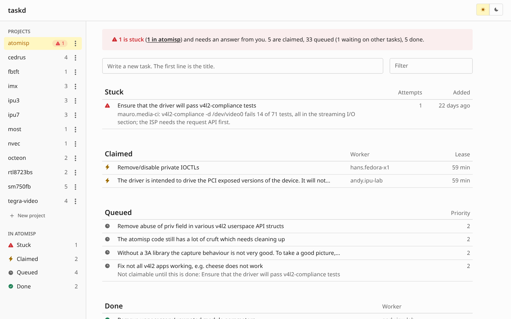
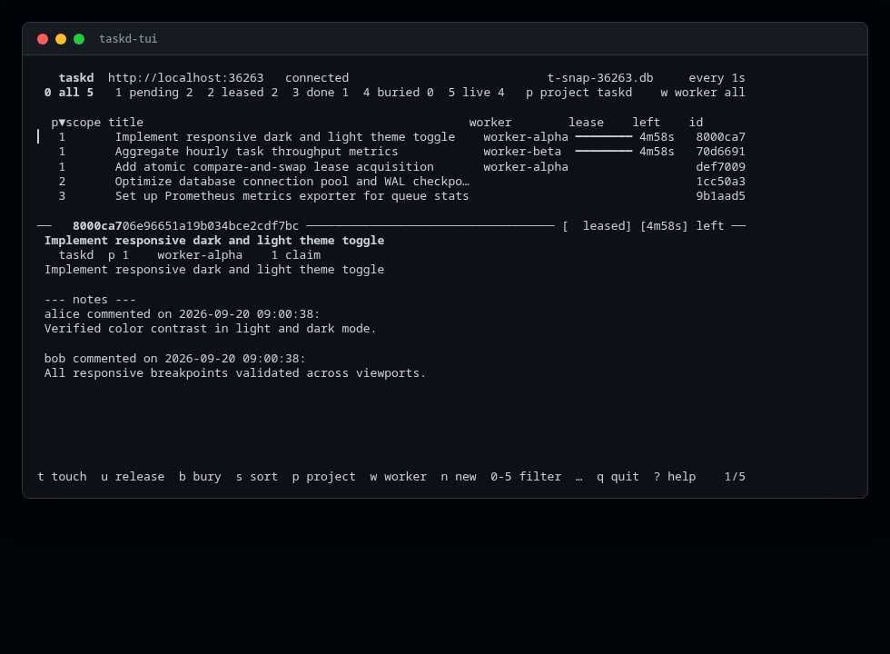

<h1 align="center">taskd</h1>

<p align="center">
  <strong>the task tracker for the modern era.</strong>
  <br>
  <strong><a href="https://igoralexey.com/taskd">igoralexey.com/taskd</a></strong>
</p>





taskd is an unapologetically simple, single-binary daemon backed by SQLite
in WAL mode with atomic leases.

taskd doesn't care if your workers are five
local git worktrees, fifty servers on a LAN, or actual humans. 

A worker claims a task, holds a lease, and either finishes or lets it expire.
When a lease expires, the daemon transitions the task back to pending in the
database via an explicit sweep. Task IDs are positive integers assigned by the
server (1, 2, 3...). All read paths (`GET /tasks`, `GET /tasks/{id}`, and
`/stats`) and the claim predicate agree on the stored state; `?status=pending`
and `/stats` pending count all available pending tasks. Append-only notes
(`POST /tasks/{id}/notes`, e.g. `/tasks/1/notes`) record history, retrievable
via `GET /tasks/{id}/notes` or inline on `GET /tasks/{id}` without mutating
the task specification. Just simple SQL and UI that works.

Tasks declare prerequisites with an `"after": [ids...]` array on `POST /tasks` or `PATCH /tasks/{id}`. A task waiting on other tasks cannot be claimed until every dependency is marked done, and dependency cycles are rejected. Once prerequisites complete, blocked tasks immediately become available for workers to claim.

By default, taskd listens on 127.0.0.1:8080 with no authentication. To expose
it on all interfaces, pass `-addr :8080` or an explicit host and port.

## Install

```sh
go install github.com/IgorAlexey/taskd@latest
go install github.com/IgorAlexey/taskd/cmd/taskd-tui@latest
```

Build from source with `go build ./...`.
